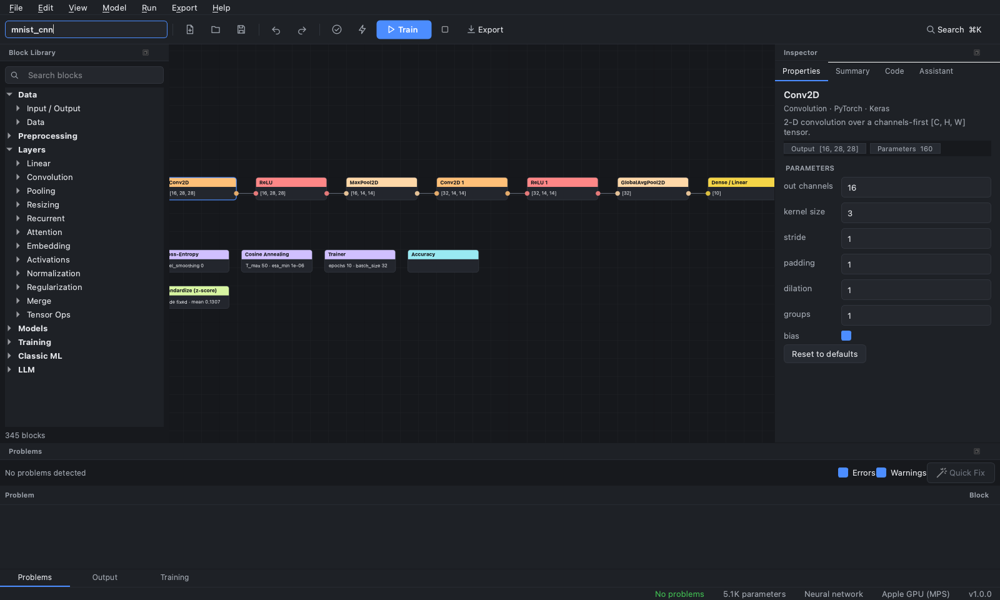
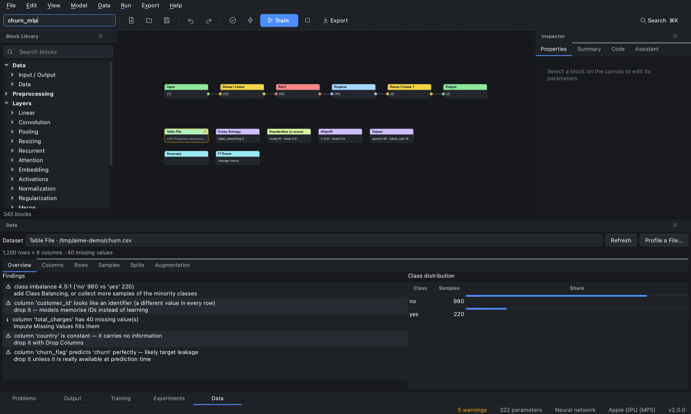
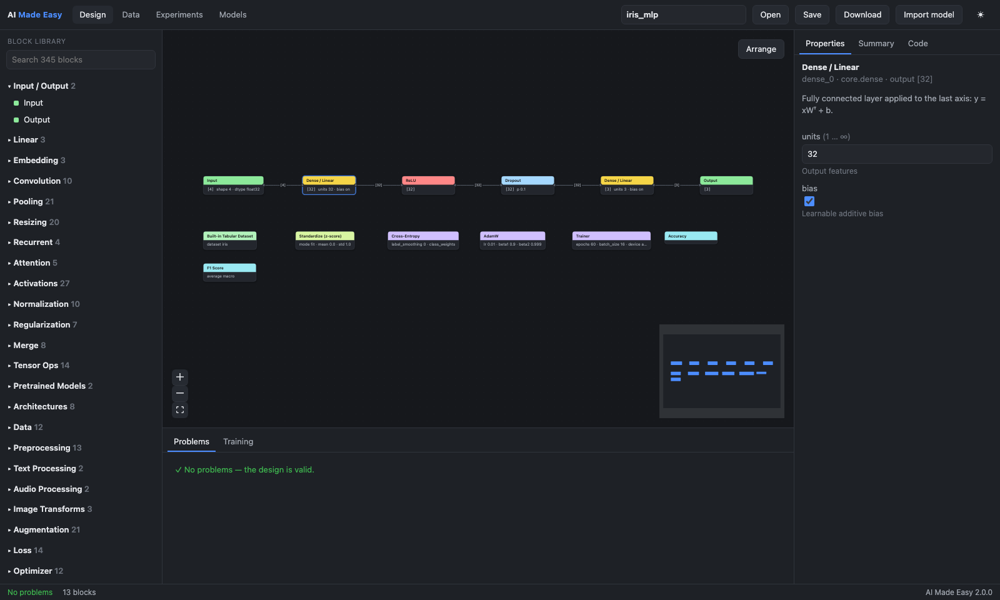

# AI Made Easy

[](https://github.com/ManoharPaturi/AI_Made_Easy/actions/workflows/ci.yml)

**Visual model builder for practitioners.** Design neural networks and classic
machine-learning pipelines by connecting blocks, with validation as you build.
Inspect your data, train, compare experiments and tune hyperparameters, then
deploy the result as a web service. The app exports clean, runnable
**PyTorch**, **Keras 3** and **scikit-learn** code, so you never write
boilerplate. It runs on the desktop or in the browser.



## Highlights

- **Start from a task, not a blank canvas:** **File ▸ New from Task** asks what you want
  to predict and where your data is, detects its format, target and classes, and ranks
  ready-to-train recipes for your data size and hardware budget, each explaining why
  every block is there. Or let **AutoML** try the recipes and tune them for you.
- **510+ blocks** across every major library: `torch.nn` layers, Keras 3
  equivalents, torchvision / `keras.applications` / timm pretrained backbones,
  Hugging Face text and image encoders, scikit-learn, XGBoost, LightGBM and CatBoost,
  plus datasets, preprocessing, augmentation, losses, optimizers, schedulers
  and metrics.
- **Design-time validation.** Shapes, ranks and dtypes are inferred live across
  branches and merges; every card shows its output shape. Incompatible wiring,
  parameter constraints and common architecture mistakes (double softmax with
  cross-entropy, class count vs dataset, missing positional encodings, …) are
  reported instantly in the Problems panel, with Quick Fixes.
- **Code you can ship.** Generated model files, training scripts and pipelines
  are executed by the test suite for every block and every modality — the real
  output shape must equal the designed shape, in both PyTorch and Keras.
- **Complete training pipelines.** Image, tabular, text, audio and time-series
  datasets; preprocessing fitted on the training split only (no leakage);
  chronological time-series splits; class balancing, MixUp/CutMix, mixed
  precision, gradient clipping and accumulation, early stopping, k-fold CV.
- **Vision tasks.** Object detection (Faster R-CNN, RetinaNet, FCOS, SSD, DETR,
  RT-DETR), instance segmentation (Mask R-CNN), keypoints and semantic
  segmentation (DeepLabV3, SegFormer, U-Net family) on COCO, YOLO, Pascal VOC or
  mask-folder datasets, with box / mask-aware augmentation and COCO mAP.
- **Forecasting and speech.** Probabilistic forecasting of one or many series
  (DLinear, N-BEATS, N-HiTS, PatchTST, TiDE, TCN, DeepAR-style RNN, Informer-style
  Transformer) with quantile / Student-t / negative-binomial heads, covariates,
  rolling-origin backtests and MASE / CRPS. Keyword spotting, CTC speech
  recognition and audio tagging with in-model mel features, wav2vec 2.0 / HuBERT /
  WavLM / Whisper encoders, and Mamba, S4D, sLSTM and TCN sequence blocks.
- **Generative models.** VAEs designed layer by layer with a Reparameterize
  bottleneck, DCGAN / WGAN-GP GANs, class-conditional diffusion (DDPM / DDIM,
  classifier-free guidance, EMA), GPT-style language models and encoder-decoder
  transformers trained from scratch, with live sample grids, FID / KID, perplexity,
  BLEU / chrF / ROUGE-L, and `/generate` endpoints in deploy packages.
- **Probabilistic models.** Bayesian networks, Markov networks, HMMs and
  structure learning (pgmpy) with CPD table editing; hierarchical models in PyMC
  with R-hat / ESS diagnostics; Gaussian processes with kernel algebra (GPyTorch,
  scikit-learn); MC dropout, Bayes-by-Backprop, mixture density networks and Laplace
  for neural networks; ECE, temperature scaling and conformal prediction;
  normalizing flows (RealNVP, MAF, neural splines); and structural time series /
  SARIMAX with the Kalman filter (statsmodels).
- **Graphs, tables, recommenders and agents.** Graph neural networks (GCN, GAT,
  GraphSAGE, GIN, …) for node / graph classification and link prediction; FT-Transformer,
  TabTransformer, TabNet and ResNet for tables with learned category embeddings; matrix
  factorisation, NCF, two-tower and DLRM recommenders with NDCG@K; and reinforcement
  learning with PPO, DQN, SAC and more, where the policy network is designed on the canvas.
- **Resource budgets.** FLOPs, training memory and latency estimates for 11
  devices (laptop CPU to H100, iPhone, Jetson, Raspberry Pi), with warnings and
  Quick Fixes when a design will not fit.
- **Analysis.** Live training curves, error analysis (with prediction overlays
  for vision tasks), Grad-CAM saliency maps and generated model cards.
- **Experiments and tuning.** Every run is recorded with its design, parameters,
  metrics, environment and data fingerprint. Compare runs side by side,
  restore any of them, and sweep hyperparameters with grid, random or
  Bayesian (Optuna) search.
- **Data workspace.** Profile a dataset before training. Missing values,
  identifier and constant columns, target leakage, duplicates and class
  imbalance are flagged in the Problems panel. Preview the exact
  train / validation / test split and the augmentation pipeline.
- **Deploy.** Turn a trained run into a serving package: a FastAPI service
  with the fitted preprocessing, a Dockerfile, and ONNX / TorchScript / Core ML
  exports. Promote versions through a model registry.
- **Import.** Open existing PyTorch modules, ONNX files and Keras models as
  editable designs, verified numerically against the original.
- **Exports.** PyTorch and Keras model files and training scripts,
  scikit-learn pipelines, ONNX, TorchScript, a single-file web demo, LLM
  workflow scripts and portable `.aime` project archives.



## Installation

Python 3.10 or newer.

```bash
git clone https://github.com/ManoharPaturi/AI_Made_Easy.git
cd AI_Made_Easy
python -m venv .venv && source .venv/bin/activate
pip install -e ".[all]"
```

Install only what you need with the optional extras:

| Extra | Adds |
|---|---|
| `torch` | In-app training, ONNX / TorchScript export |
| `vision` | torchvision datasets, transforms and pretrained backbones |
| `vision-tasks` | timm backbones, Hugging Face DETR / SegFormer / DINOv2, COCO RLE masks |
| `audio` | Hugging Face speech encoders (wav2vec 2.0, HuBERT, WavLM, Whisper) |
| `probabilistic` | pgmpy, hmmlearn, PyMC, GPyTorch and statsmodels (graphical models, probabilistic programs, Gaussian processes, state-space models) |
| `graph` | PyTorch Geometric (graph neural networks) |
| `rl` | Gymnasium and stable-baselines3 (reinforcement learning) |
| `data` | pandas-backed table files (CSV, TSV, Parquet, Excel, JSON) |
| `classic` | scikit-learn, XGBoost, LightGBM, CatBoost |
| `keras` | Keras 3 for running exported Keras code |
| `llm` | Hugging Face generation, LoRA fine-tuning and RAG scripts |
| `mcp-server` | Model Context Protocol server for AI agents |
| `web` / `serve` | Browser UI (`aime web`) and serving packages (FastAPI, uvicorn) |
| `export` | ONNX / onnxruntime / skl2onnx exports and verification |
| `tuning` | Bayesian hyperparameter search (Optuna) |
| `dev` | Test and lint tooling |

## Quick start

```bash
ai-made-easy            # or: python -m ai_made_easy
```

1. Start with **File ▸ New from Task** (<kbd>Ctrl+Shift+N</kbd>) to get a ranked recipe
   for your task and data, or drag blocks from the **Block Library** (or press
   <kbd>⌘K</kbd> / <kbd>Ctrl+K</kbd>) and connect them on the canvas.
2. Edit parameters in the **Inspector**; shapes and problems update live.
3. Add a dataset, loss, optimizer and Trainer block, then press **Train**.
4. Export from the **Export** menu, or browse **File ▸ Open Example** for
   complete projects (CNNs, transfer learning, tabular networks, gradient
   boosting with grid search, clustering, LLM workflows).

## In the browser

```bash
pip install -e ".[web,torch,vision,data,classic]"
aime web --open                 # http://127.0.0.1:8765
docker build -t ai-made-easy . && docker run -p 8765:8765 ai-made-easy
```

The web version shares the engine, run history and model registry with the
desktop app. Hosting, authentication and the REST API are covered in
[docs/WEB.md](docs/WEB.md).



## Block library

| Section | Blocks | Contents |
|---|---|---|
| Data | 28 | Input / Output, torchvision benchmarks, image / text / audio folders, table files, scikit-learn datasets, NumPy, JSON, Hugging Face, time series, forecasting tables, speech manifests, text corpora and pairs, COCO, YOLO, Pascal VOC, mask folders, synthetic |
| Preprocessing | 41 | Split, loader, class balancing, imputation, encoding, scaling, outlier clipping, tokenization, audio features, SpecAugment, 24 image transforms incl. RandAugment, AutoAugment, AugMix, MixUp / CutMix |
| Layers | 132 | Linear, convolution (1-3D, transposed, depthwise, separable), pooling, padding / resizing, recurrent, attention & transformers, embeddings, 27 activations, normalization, regularization, merges, tensor ops |
| Sequences & Forecasting | 14 | TCN, Mamba, S4D, sLSTM; mel spectrogram / MFCC front-ends; 8 forecasters with point, quantile, Student-t and negative-binomial heads |
| Generative | 8 | Reparameterize (VAE), causal transformer, DCGAN generator, diffusion U-Net, GPT, seq2seq transformer, discriminator, noise scheduler |
| Models | 20 | Detectors, instance / semantic segmenters, keypoint detector, U-Net family, 39 torchvision + 87 timm backbones, Hugging Face text, image and speech encoders, architecture templates |
| Training | 91 | 19 losses (incl. Dice, Tversky, Lovász, CTC), 12 optimizers, 12 LR schedulers, trainer, k-fold, 46 metrics (incl. COCO mAP, mean IoU, PCK, MASE, CRPS, WER / CER, FID, KID, perplexity, BLEU, chrF) |
| Classic ML | 68 | 55 estimators (linear, SVM, neighbors, Bayes, trees, ensembles, boosting, clustering, anomaly detection), feature engineering, TF-IDF, hyperparameter search |
| LLM | 15 | Model, tokenizer, prompts, LoRA / QLoRA fine-tuning, embeddings, vector store, retrieval, RAG |

Save any selection of blocks as a reusable custom block (**Model ▸ Save Selection as Block**).

## Command line

```bash
aime validate project.json                     # design + data checks; exit 1 on errors
aime gen project.json -f pytorch -o exports    # model file (pytorch | keras)
aime train project.json -f keras -o exports    # training script (pytorch | keras | sklearn)
aime run project.json                          # train headlessly, stream JSON events
aime runs list | show ID | compare A B         # run history
aime sweep project.json -p opt.lr=log:1e-4:1e-1 -p d1.units=choice:32,64 -n 12
aime new --task binary --data churn.csv -o churn.json   # best recipe for the data
aime automl --task binary --data churn.csv -n 12 -o best.json   # search the recipes
aime recipes --task forecasting                # recipes per task
aime data profile data.csv --target label      # dataset profile and findings
aime data split project.json                   # samples per class in each split
aime deploy RUN_ID -o serving --formats onnx   # serving package from a run
aime serve serving                             # run it with uvicorn
aime models list | register RUN NAME | stage NAME VERSION production
aime import onnx model.onnx -o project.json    # also: pytorch (--attr, --shape), keras
aime web                                       # browser UI + REST API
aime blocks                                    # every block as a JSON schema
```

## Agents and assistants

The same engine is available to AI agents through an MCP server (`aime-mcp`),
with tools to list blocks, validate graphs, generate code, train, run sweeps,
deploy, import models and profile data.
The in-app **Assistant** panel connects to any OpenAI-compatible endpoint,
including local servers such as Ollama or LM Studio
(`AIME_ASSISTANT_BASE_URL`, `AIME_ASSISTANT_API_KEY`, `AIME_ASSISTANT_MODEL`).

## Desktop bundle

```bash
scripts/build_app.sh      # PyInstaller: macOS .app, Windows / Linux folder in dist/
```

The bundle contains the designer; training and export runs use a Python
environment with the frameworks installed (`$AIME_PYTHON`, or `python3` on the
`PATH`).

## Development

```bash
pip install -e ".[all,dev]"
ruff check ai_made_easy scripts tests
pytest                                  # ~850 tests, includes real training runs
cd web && npm ci && npm run build && npx playwright test   # web UI
UPDATE_GOLDEN=1 pytest tests/test_golden.py
python scripts/build_examples.py        # regenerate example projects
python scripts/verify_codegen.py --keras
```

Architecture and design rules: [docs/ARCHITECTURE.md](docs/ARCHITECTURE.md).
Web version: [docs/WEB.md](docs/WEB.md). Roadmap: [docs/ROADMAP_2.0.md](docs/ROADMAP_2.0.md).
Release notes: [CHANGELOG.md](CHANGELOG.md).

## License

[MIT](LICENSE)
